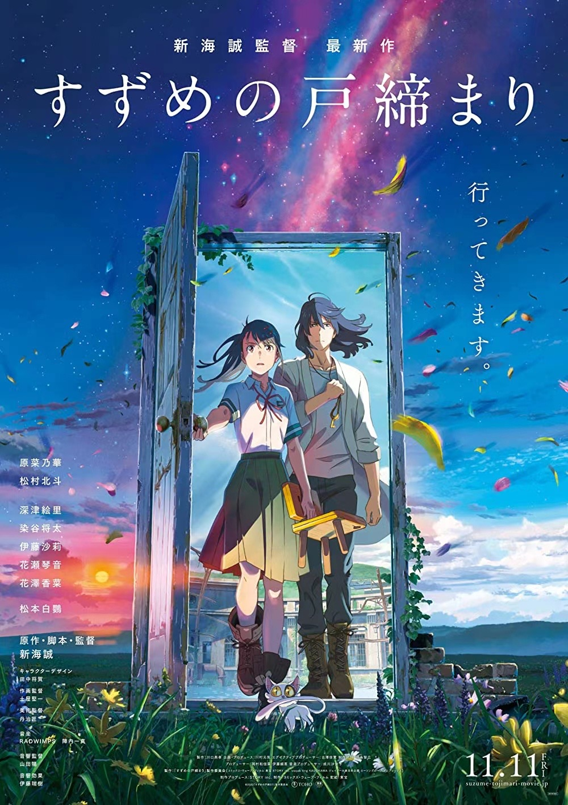

---

>
> 影评中的所有观点仅为个人观点，若有分歧，以你为主
>

---

**———分界线（剧透警告）———**

新海诚的电影之所以能够给观众带来情感上的共鸣，是因为他擅长通过讲述散乱的支线故事，不断铺垫角色与角色之间的关系。然后当观众逐渐被代入剧情时，电影的高潮会将之前铺垫的情绪全部释放出来，让观众感受到故事的魅力。例如，《秒速五厘米》中贵树与明里从相思到释怀的过程，《言叶之庭》中孝雄与雪野在庭院里相互救赎的对话，《你的名字》中瀧和三叶跨越时间和空间的牵绊，《天气之子》中帆高为了爱情而放弃整个世界的选择。这些作品通过细腻的支线剧情和人物刻画，让观众在不知不觉中代入电影的世界，感受着新海诚那独特的文学风采。然而，这次他执导的《铃芽之旅》却让我感到失望。这部电影虽然以日本311大地震这样一个深刻的事件为背景，却没有带来像他前几部作品那样的情感冲击。其原因在于，这部电影未能很好地利用其本身的潜力，而是为了迎合恋爱题材而牺牲了其他方面。

## 环阿姨的角色

这部电影中的环阿姨是一个对铃芽来说十分重要的角色。在铃芽的生母因灾难去世后，环阿姨一直照顾着铃芽，给她带来温暖和安慰。可以说，她对铃芽有着深厚的感情。但在电影中，新海诚没有给她足够的篇幅来展现她的想法与感受。影片到结尾时，环阿姨被左大臣操控后对铃芽讲出了埋藏在心底的话，并向铃芽道歉，最终和铃芽和好如初。这样仓促的一笔带过，让人感到非常遗憾。

## 男女主角的感情戏

这部电影中男女主角之间的感情戏实在毫无逻辑可言。草太作为男主角，在整部电影中几乎没有任何刻画，除了追猫就是念咒关门。他与铃芽之间的感情戏没有任何有意义的互动与交流。整部电影看下来，我没有看到任何对男女主角为何爱上彼此的情感铺垫。这导致当女主说出“没有草太先生的世界我不要啊！”这样的话，以及草太一个拥有良好社交圈和朋友的人却表现出因为遇到女主而不想死的情节时，让人感到非常不合理。这些突兀的情感插入不仅没有增色，反而让电影失去了焦点与深度。

## 电影潜力的未充分发挥

这部电影最可惜的点在于未能充分发挥和展现其本身具有的潜力。轮回、常世、往门等设定都蕴含着许多可以探讨的主题，比如过去与现在、记忆与遗忘、生命与死亡、幸福与痛苦等。这些题材如果任选一个作为重点展开，都可能使这部电影变成一部很有深度的作品。例如，铃芽作为曾经大地震的受害者，肯定对过去和现在、生命和死亡有自己的看法和感受。在这部电影中，铃芽的自我救赎应该比爱情更加重要。但可惜的是，这些有深度的设定和剧情在电影中并未得到充分发挥。相反，电影却将大部分时间花在了草太和铃芽之间完全不必要的恋爱上，直接导致电影失去了新海诚独有的文学风采、情感震撼和主题深刻的特点。

## 总结

如果将《铃芽之旅》视作一部普通的动画电影，它是一部画面优美、笑点频繁的日常风动画。但如果你期待看到新海诚一贯的文学风采、情感震撼和深刻主题，那么这部电影大概率会让你失望。我的评分是7.5/10分，就个人而言，这部电影不会像新海诚的前几部作品那样让我反复观看。

