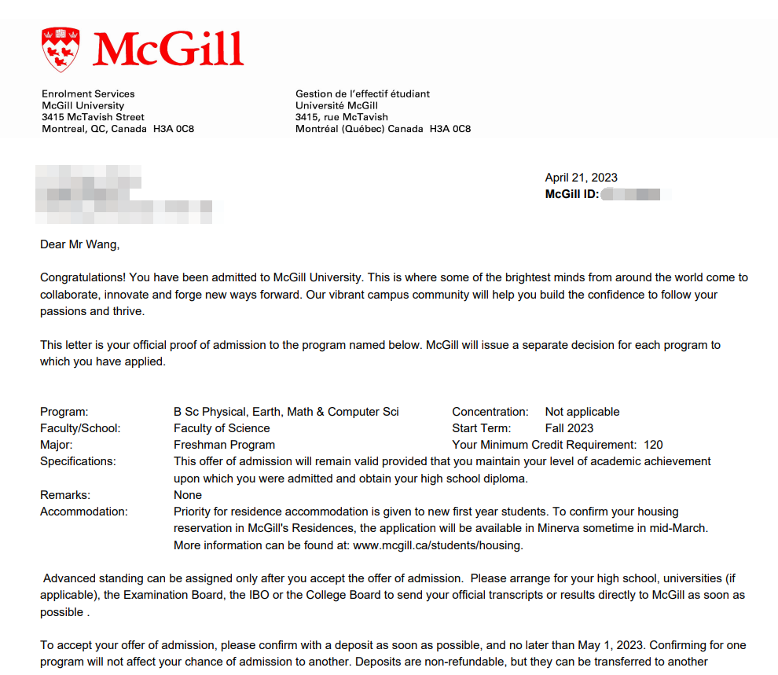

随着2023年申请季的结束，我想用这篇文章来总结一下我在申请大学期间的心路历程，并回答一些关于大学申请大部分人最关心的几个问题，供下届即将申请大学的学弟学妹们参考。

### Part 1 我的心路历程

首先，简单介绍一下我的成绩。我的均分是96，具体科目如下：

- Pre Calculus: 98
- Physics: 93
- ELA: 93
- AP CompSci: 98
- Intro to Calculus: 98

可以说，这个成绩算不上特别突出，但也不差。然而，随着申请季的开始，我的自信心却逐渐被消磨了。原因在于我参考了很多上届毕业生的成绩和录取情况，发现有几位均分97、98的学长学姐竟然没有被多伦多大学录取（到现在我也不知道为什么）。这些信息让我对自己的成绩失去了信心，压力倍增，甚至陷入了深深的迷茫，感觉自己的人生仿佛要毁于一旦。

申请季从十月初开始，我也是第一时间递交了申请，几乎把我能申请的所有大学都申了一遍。我的想法很简单：不奢望进顶尖大学，只希望有一所像样的学校录取我。之后就是漫长的等待录取通知书的日子，真是度日如年。我甚至养成了每天刷几十遍邮箱的习惯。

还记得收到第一封录取通知书时的激动心情，录取我的学校是艾伯塔大学，虽然不算特别有名，但那时的我已经很满足了。随着陆续收到其他大学的录取通知书（其中包括几所世界排名前50的大学），我才逐渐认清了自己的能力。也正是因为这一经历，我决定写这篇文章，希望通过我的亲身经历，帮助学弟学妹们避免走我走过的弯路，少在一些不必要的事情上浪费时间和精力。

### Part 2 申请中的常见问题总结

通过我的观察，我总结了四个大多数申请生关心的问题：申请时间、成绩、12年级选课和AP课程。

#### 申请时间
这方面99%的信息都可以直接搜出来，所以我也没什么好讲的。基本上申请季是从十月份开始一直到五月中旬结束，绝大多数录取通知书会在这个期间发放，在这之后，大学会进行极少量查漏补缺，基本上五月中旬之后还没拿到录取通知书的也就不需要再继续等了。而对于申请我唯一的建议就是越早申请越好，不要拖，因为加拿大的大学大多都采用的是滚动式录取和分轮次录取，所以如果你的均分不是很差在90+左右，那么我建议你越早申请越好，因为越早申请机会越大。

#### 成绩
不要过于在意自己的成绩，尽力而为即可。加拿大的大学（除了UBC）通常只看12年级的五门最高分课程，这包括申请专业所需的必修课和一门12年级英语课，在这之后，如果没有凑齐五门课，则会按成绩顺序（从高到低）补齐五门，再取均分。一般来说，均分高于官网录取分数线7到10分就是很有竞争力的成绩了。这里不得不吐槽一下那些均分96+的人（我也在内），如果你的目标不是滑铁卢计算机系或者工程系，就别抑郁上不了大学了，这个分数基本上在加拿大的大学可以横着走了，不要像我一样错误的评估了自己，导致自己在整个申请季都处于抑郁的状态，过的魂不守舍的。

再来是提交成绩方面，如果你之前的成绩不太好，那么在每次12年级出成绩单时，都要第一时间就要去找辅导员要你的成绩单，因为大学在审核时，是以你的最新上传的文件审核的，况且提交成绩也花不了你多少时间，所以不要觉得晚两天不重要，然后一直拖着这件事情，有了新成绩就去上传，自己要操心着这件事情。

#### 选课
我是理科生，所以这里只针对理科生提供建议。12年级的必修课首推Pre-Calculus和微积分，这两门课相对简单，容易拉高平均分。其次是物理、化学、生物，如果大学没有明文要求，那么三选二即可。选择方面，若不学医，建议上物理和化学，因为这两门课一方面是最不需要死记硬背知识点的课，另一方面是你从中会学到许多生活中的常识，我觉得对于以后还是挺有帮助的。至于英语课，无论你是否申请大学，都是必修课，选一个不压分的老师即可。

在选择完这些课程后，建议再选一到两门“水课”来拉高均分，并且不要把课程排得太满（学分不够毕不了业无视这段话）。12年级的课程普遍较难，且每次考试都很重要，需要留足时间来准备。别问我怎么知道的——我曾有过一天考四门课的经历，结果自然是一团糟。

#### AP课程
加拿大的大学不太看重AP成绩，所以如果必须在AP课和普通课中二选一的话，无脑跟着普通班上就行了，因为普通班给的分高。在加拿大这边不会因为你上了AP课就给你加分，甚至如果一个普通班的学生拿的成绩比上AP班的你的成绩高，那么加拿大的大学会优先录取普通班的学生（如果你是学霸、对自己的成绩极其有自信的那种，那么当我没说）。

### 结语

无论你准备申请什么大学、什么专业，12年级的成绩都至关重要。因此，在12年级一定要对自己狠一点，努力提高分数，让自己在大学申请中更具竞争力。最后，祝所有即将申请大学的同学们，少些迷茫、少走弯路，早日拿到心仪大学的录取通知书！如果你有关于大学申请的其他问题，可以随时给我发私信，我会在力所能及的范围内给予答复。

**———分界线———**

来看一下今年我的战果吧：

- **University of Toronto 三部曲**
    
  
(<em>St. George Campus</em>)

    
  
  
(<em>Scarborough Campus</em>)

  
    
  
  
(<em>Mississauga Campus</em>)

- **University of British Columbia**  
  

- **McGill University**  
  

- **University of Waterloo**  
  

- **McMaster University**  
  

- **University of Alberta**  
  

- **Simon Fraser University**  
  

- **Queen's University**  
  

- **Western University**  
  