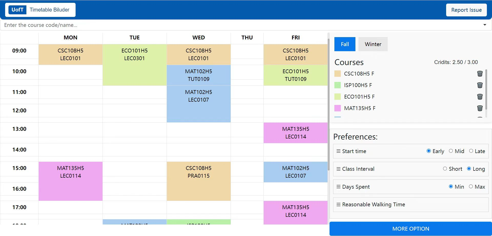
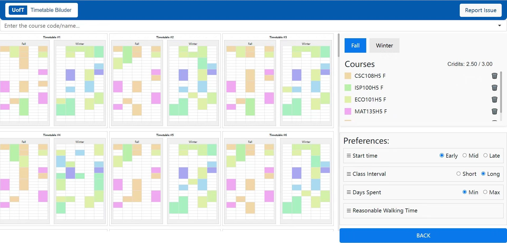
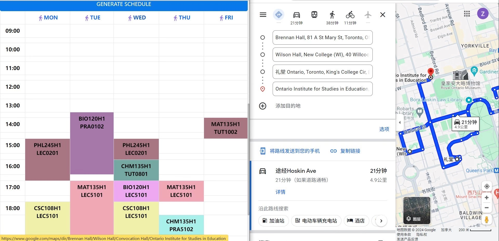
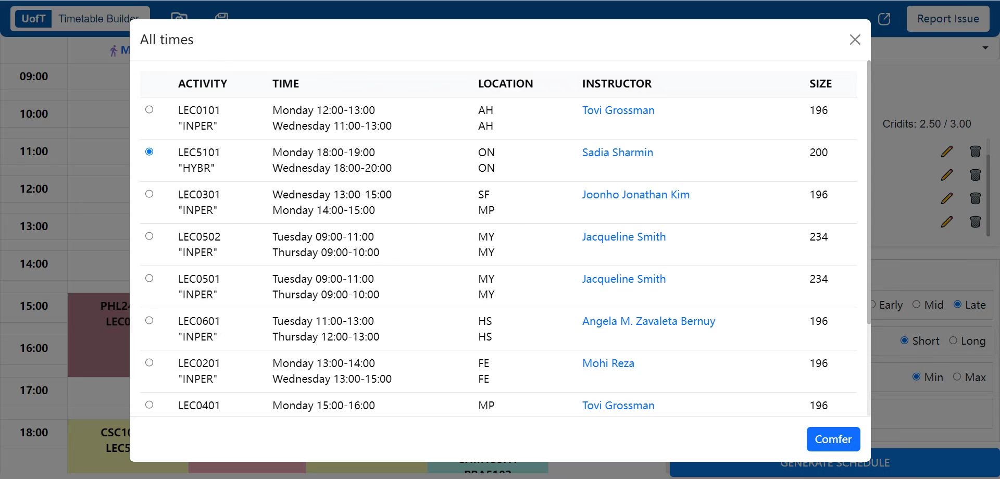
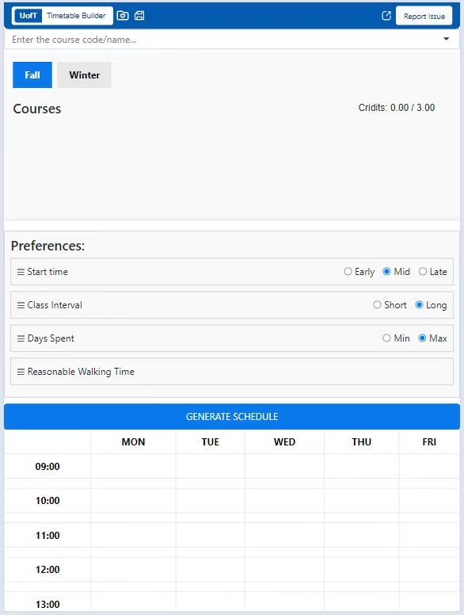

## 前言

哎呀，和朋友熬了两周的夜，总算在冬假结束之前完成了这个项目。让我来分享一下这两周的经历吧。最初，我与朋友商定的项目是一个基于 PyQt5 编写的应用程序。在完成了该项目的两个功能后，我们陷入了不知道接下来写什么功能的困境。于是，我们决定换一个项目，至此诞生了这个课表生成器。现在回想起来，我已经两年没有参与过任何大型项目了。上一次是在高中时进行的一个存储项目，时间真的过得飞快。

谈到这次的项目，这是我到目前为止做过的时间最紧迫的项目。我到现在都不敢相信，我和朋友在两周的时间里，不仅从前端学到后端、接触了各种框架、学了爬虫、研究了算法，还真正把这个项目做出来了。想起这两周赶进度，几乎每天都是早起写代码、调试修复 bug 直到深夜四五点才入睡。我真的觉得自己好像把前 18 年没用完的调试精力全部用在了这个项目上。不过，当今天正式将网站部署到服务器那一瞬间，突然感觉特别有成就感。哈哈，不多说了。对于读到这里的朋友，非常感谢你能耐心看完我的碎碎念。让我们在下一个项目中再会吧～

> ***挖个坑，之后如果有空，可能会专门再出一篇专门探讨这个项目技术的文章（前提是得有空）***

## 简介

每年面对多大的简陋课表生成器，你是否曾感到苦不堪言？在排课表的过程中，你是否浪费了大量时间，却仍未能生成符合心意的课表？如果是，那么你来对地方了！

我们的课表生成器旨在解决这些问题！这款产品可以根据用户需求（如课程分布时间：早/中/晚、课间间隔时间：长/短、上课天数：多/少），自动生成50张符合要求的课表供用户选择！更多详细信息请参阅底部的 GitHub 链接～

---

## 未来计划

- 添加用户自选课程时间功能
- 添加时间锁功能
- 添加保存课表功能
- 添加可动态拖拽课程换课功能
- 优化算法时间复杂度
- 适配移动端

---

## GitHub 项目链接

我们的 GitHub 项目链接（已开源）：[UofT-Timetable-Builder](https://github.com/UofT-Box/UofT-Timetable-Builder)

---

## 实机演示图

#### 主页+选课

#### 选择更多课表

---

# [2024-01-09] 更新日志

- 已适配移动端
- 网站增添了 SSL 证书

---

# [2024-02-23] UofT-Timetable-Builder-V2

## 本次更新内容

+ 添加了用户自定义课程时间功能
+ 添加了用户锁功能
+ 添加了课程表导出功能
+ 添加了课表收藏夹功能
+ 添加了展示路程&时间功能

+ 适配了移动端

---

## 更新说明

本次更新应该是我们这个项目最后一次大版本更新，之后可能不会添加新的大功能。目前这个项目已经足够稳定了，该适配的也已适配完毕。终于可以把重心放到开发其他项目上了～

---

## 演示图

#### 展示路程&时间功能

#### 用户自定义课程时间功能

#### 移动端适配

