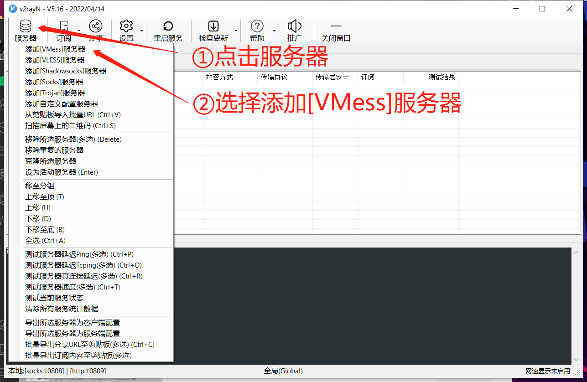
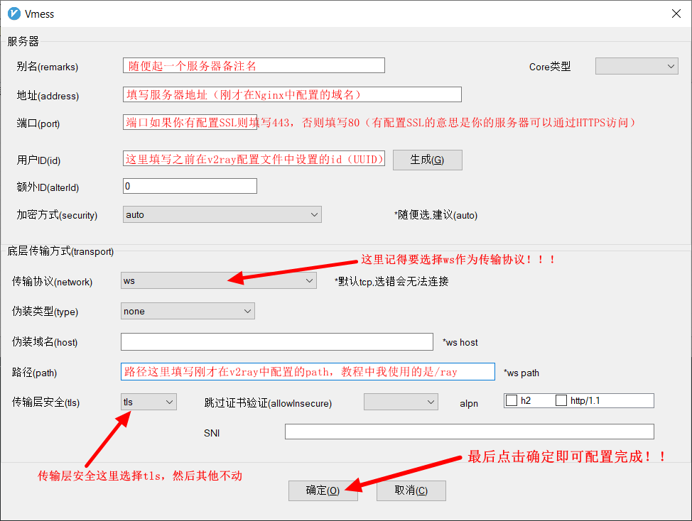

## 前言

由于众所周知的原因，一些网站在国内是无法访问的。对于我们这些搞技术的人来说，这当然不是问题，然而对于家里的长辈们来说，就不那么容易应对了。最近，我家人要回国，而我们家有个惯例——当家人回国时，留在国外的人就需要关注他们的邮箱和各种账户信息（毕竟，Gmail 和一些银行的 APP 在国内打不开）。

你可能会问，为什么作为一个技术人员，我不直接给家里人安装一个“梯子”，这样不就省事了吗？咳咳，这其实有一大部分是我的原因。这些年来，为了图个方便，我一直在用某机场（一个私服）提供的梯子服务。虽然这种服务价格便宜，一年才不到50人民币，但它的安全性和隐私保护就很难保证了（毕竟“腐竹”会不会收集用户的访问信息是一个未知数）。当然，对于我个人来说，由于对网络安全有足够的警觉，我自己是可以做到在使用时规避这种风险的。但是，家中长辈们对技术并不熟悉，很难做到像我这样小心翼翼地保护自己的隐私，因此这种服务一直也只是我自己在使用。

而这次，因为刚考完试手头有些空闲，加上家人即将回国，我决定自己动手为家人搭建一套VPN服务。毕竟，自己搭建的服务可以完全掌控，我就能放心给家人使用了。说干就干，经过几个小时的折腾，翻阅了四五个文档之后，我终于成功搭建了出一个“热乎”的私人VPN。

在写这篇博客时，我的目的就是希望把这些经历和心得总结出来。虽然过程说起来轻松，但实际操作中也踩了不少坑。因此，我希望通过这篇文章，能帮助到遇到同样需求的你，让你少走弯路，半个小时内就能搞定属于自己的VPN服务。

## 正文

### 1. 准备工作

在开始搭建之前，你需要准备以下几点：

- 一台VPS（如果有翻墙需求，选择境外服务器）
- 一个域名（可选）：虽然不是必须的，但为了后续的管理和使用方便，建议为你的VPN服务配置一个域名。
- 基本的Linux操作系统知识：我使用的服务器Linux系统，搭载的是 `Ubuntu Server 22.04.4 LTS` 版本。当然，你也可以选择其他的发行版，但命令可能会有所不同。

### 2. 安装V2Ray

> 解释一下我选择使用V2Ray来搭建VPN服务的原因是，在查阅了相关资料后，我发现V2Ray采用的VMess加密协议具备无状态的特性。简单来说，客户端和服务器之间不需要握手就可以直接传输数据，每次的数据传输都是独立的，与之前或之后的传输没有关联。这种特性使得它在应对国内防火墙的检测时更为有效，降低了被识别和拦截的风险。

首先，链接到你的VPS服务器，然后执行以下命令来安装V2Ray：

```bash
bash <(curl -L https://raw.githubusercontent.com/v2fly/fhs-install-v2ray/master/install-release.sh)
```

这条命令会自动下载并安装V2Ray，同时会生成一个基本的配置文件。安装完成后，你可以通过以下命令检查V2Ray是否安装成功：

```bash
systemctl status v2ray
```

如果显示V2Ray正在运行，那么安装成功了。若不成功可能是权限的问题，尝试以下指令分步安装：

```bash
curl -O https://raw.githubusercontent.com/v2fly/fhs-install-v2ray/master/install-release.sh
sudo bash install-release.sh
```

### 3. 配置V2Ray

接下来，我们需要配置V2Ray，使其符合我们的需求。V2Ray的配置文件通常位于 `/usr/local/etc/v2ray/config.json`，你可以使用你喜欢的文本编辑器（比如 `vim` 或 `nano`）打开并编辑这个文件，指令如下：

```bash
sudo vim /usr/local/etc/v2ray/config.json
```

打开配置文件后，如果里面已经有内容了需要全部删掉，然后复制粘贴下面的内容到`config.json`里：

```json
{
  "log": {
    "loglevel": "warning",
    "access": "/var/log/v2ray/access.log",
    "error": "/var/log/v2ray/error.log"
  },
  "inbounds": [
    {
      "port": 10086,
      "listen":"127.0.0.1",
      "protocol": "vmess",
      "settings": {
        "clients": [
          {
            "id": "这里粘贴一个你的UUID",
            "alterId": 0
          }
        ]
      },
      "streamSettings": {
        "network": "ws",
        "wsSettings": {
        "path": "/ray"
        }
      }
    }
  ],
  "outbounds": [
    {
      "protocol": "freedom",
      "settings": {}
    }
  ]
}
```

稍微解释一下这分配置：

- **inbounds**: 这里定义了V2Ray服务器监听的端口和协议类型。这里我们选择 `VMess` 协议作为入站连接，你可以修改端口号以避免被防火墙或ISP检测到。
- **streamSettings**: 这个是来设置底层传输方式的。这里面 `"network": "ws"` 指使用WebSocket作为我们的传输协议，WebSocket 是一种在单个TCP连接上进行全双工通信的协议，通常用于绕过防火墙，因为 WebSocket 流量看起来和普通的 HTTP 流量很相似。接下来我们在 `wsSettings` 中为ws添加一个path的配置参数，这里因为演示，我们使用 `/ray` 作为我们的路径。这个路径在 WebSocket 握手时会被发送给服务器，用于识别和区分不同的 WebSocket 流量。路径可以任意设置，通常会使用一个独特的路径来避免被检测到。
  - 简单来说，streamSettings 就是用来告诉 V2Ray，数据要通过哪种方式传输。在你的配置里，它指定了使用 WebSocket 这种方式，这样流量看起来就像普通的网页浏览数据，更不容易被发现或者被阻止。它就像是在给 V2Ray 的数据加上一层伪装，让它更容易通过防火墙或不被审查盯上。
- **outbound**: 它定义了数据的出站方式，我们这里设置的是`freedom`即任意协议都可以。
- **UUID**: 这是客户端连接到你的V2Ray服务器时的唯一标识符。你可以通过以下命令生成一个新的UUID：

    ```bash
    cat /proc/sys/kernel/random/uuid
    ```

    将生成的UUID替换到配置文件的 `id` 字段中。

编辑完成后，保存配置文件并**重启**V2Ray服务：

```bash
sudo systemctl restart v2ray
```

### 4. 安装并配置Nginx

为了隐藏我们的V2Ray流量，我们可以通过Nginx设置反向代理。首先，安装Nginx：

```bash
sudo apt update
sudo apt install nginx
```

安装完成后，我们开始配置Nginx，首先为v2ray单独创建一个配置文件并进入一个，输入以下指令：

```bash
sudo vim /etc/nginx/conf.d/v2ray.conf
```

在这个配置文件中，添加以下内容：

```nginx
server {
  listen 80;
  server_name yourdomain.com; # 替换你的域名

  access_log /var/log/nginx/v2ray.access;
  error_log /var/log/nginx/v2ray.error;

    location /ray { # 这里的path必须与V2Ray配置文件中的吻合
      if ($http_upgrade != "websocket") { 
          return 404;
      }
      proxy_redirect off;
      proxy_pass http://127.0.0.1:10086; # 这里的端口必须和v2ray配置文件中填写的一样
      proxy_http_version 1.1;
      proxy_set_header Upgrade $http_upgrade;
      proxy_set_header Connection "upgrade";
      proxy_set_header Host $host;
      # 在 access.log 中展示真实IP
      proxy_set_header X-Real-IP $remote_addr;
      proxy_set_header X-Forwarded-For $proxy_add_x_forwarded_for;
      proxy_set_header X-Forwarded-Proto $scheme;

    }
}
```

将 `yourdomain.com` 替换为你的域名，并确保端口号与V2Ray配置文件中设置的监听端口一直。保存文件后，测试Nginx配置是否正确并重载Nginx：

```bash
sudo nginx -t
sudo systemctl reload nginx
```

### 6. 配置客户端

Windows用户，可以选择使用v2rayN软件进行连接，步骤如下：





IOS用户，可以选择小火箭（Shadowrocket）进行连接，配置方式与v2rayN软件的配置方式极其相似，这里就不再演示了。

### 结语

至此，我们已经成功搭建了一套基于V2Ray和Nginx的VPN服务。虽然过程看起来复杂，但只要一步步按照教程操作，你很快就能搭建出属于自己的私人VPN服务。希望这个教程能帮助到你。


