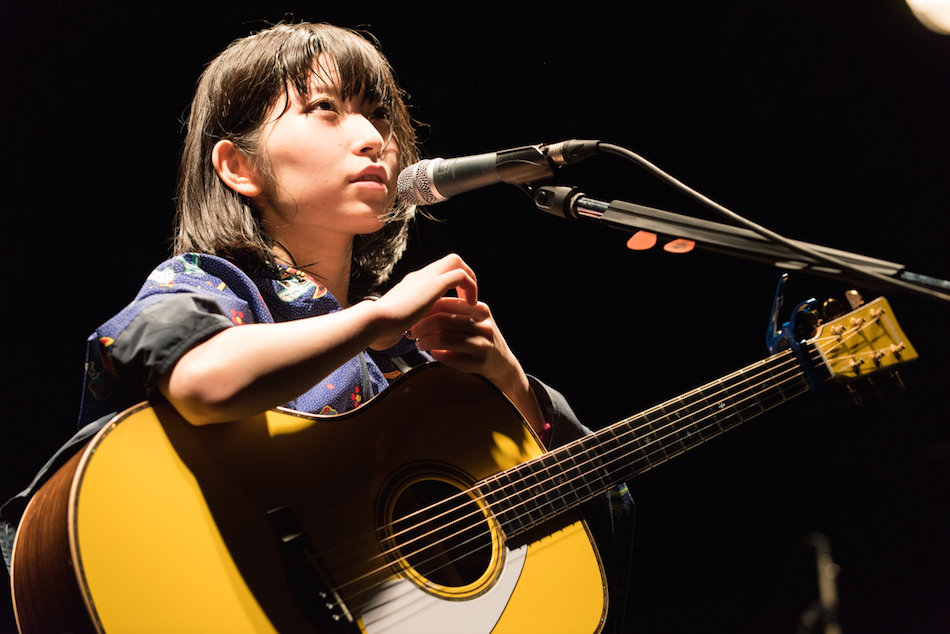

## 1

2024年9月27日，像往常一样，我结束了一天的课程，拖着疲惫的身躯回到家中。随意地靠在椅子上，我打开了视频网站，只是想让自己放松片刻。就在这个再平凡不过的夜晚，屏幕上突然弹出的讣告，击穿了我所有的防线——酸欠少女さユり……去世了。

我愣住了，时间仿佛在那一瞬凝固。屏幕上的那些冰冷的文字像刀锋一样割裂了我对现实的理解，我不敢相信，也不愿相信自己的眼睛。这是我无数次点进她的频道，却再也等不到她新歌的一刻。她的离去仿佛划开了一道深深的伤口，让我措手不及、无所适从。在那一刻，所有情绪一齐倾泻而出，悲伤、痛楚、迷茫，如同汹涌的潮水，一次次淹没我。

## 2

过去的一周里，我就像失去了方向的船只，随波逐流般过着每一个毫无意义的日子。耳边总是萦绕着さユり的歌声，仿佛她依然在用音乐温柔地抚慰我。我反复地听着那些旋律，仿佛想在她的歌声中找到哪怕一丝她还在的证据。然而，她真的走了，像一道消失在夜空中的流星，再也没有了踪影。

还记得大概是在2019年，我第一次遇见了她。那是一个漫无目的的夜晚，我随意地在网络上游荡，无意中看到了推荐说《乱步奇谭》的音乐极其出色。怀着好奇心点了进去，结果，一首『ミカヅキ』彻底俘虏了我的心。她的嗓音带着一丝沙哑，又充满着难以名状的力量，那是一种能够刺穿内心最深处的声音。当第一句人声响起，仿佛我的世界被打开了一扇全新的大门，我知道自己找到了某种特别的存在。

她的歌声里，总是隐含着一种无法言喻的情感，那种痛苦、迷茫和挣扎的音符，仿佛在述说我内心深处的故事。每一首歌、每一个音符，像一根根细细的丝线，将我拉入她编织的世界。在那里，所有的孤独与不安都能得到认同，所有的脆弱都不再羞于展示。

从那一刻开始，我便一发不可收拾地迷恋上了她的音乐。起初是『ミカヅキ』和『平行線』，后来，我开始追寻她所有的作品，寻找她每一段街头演唱的影像。她的音乐不仅仅是旋律，而是一种深切的陪伴。她用歌声和她的故事，伴我走过那些无数次的低谷与迷茫，她努力奋斗的身影，是我在黑暗中唯一的光。

## 3

尽管さユり有着许多深入人心的经典之作，但对我来说，最让我动容的却是那些少为人知的珍贵小曲。像『光と闇』、『トイ』、『オーロラソース』、『birthday song』、『るーららるーらーるららるーらー』、『来世で会おう』……等好多好多首歌，都有着她的独特色彩，每一首我都保存在歌单里反复聆听。我尤其喜欢她自弹自唱的版本，没有华丽的编曲，只有最原始的旋律和她那直击心灵的声音。她的歌声像一片最纯粹的心灵独白，音符和词句的每一次触动，都会在我的心中激起涟漪。

我还记得自己无数次地期待着，盼望有一天她能将那些未收录的Live限定曲目收入专辑。而如今，这些曲目注定无法再成为专辑的一部分了。她那些未完成的梦想，也随着她的离开永远定格在了时间的深处，变成了无可挽回的遗憾。

## 4

这些日子，本打算记录一些我在开发个人网站时的心得体会，还有对博客未来的一些规划。然而，さユり的离去打乱了我的所有思绪，我再也无心去书写那些琐碎的技术细节。写下这篇文章，只是为了将我这些天以来沉重的情绪宣泄而出，因为心中的痛苦实在难以排遣。

这是我第一次经历自己如此喜欢的歌手离世的打击，这种失去感让人措手不及，仿佛在胸口留下了一道无法愈合的创伤。每当想到她再也不会创作新的音乐，再也听不到她的声音，我的心就像被沉重的乌云笼罩。那些无法言说的悲哀与无力感，在每一个寂静的夜晚愈加浓烈，成为一种无处安放的重量。

さユり，她的音乐陪伴了我这么多年。而现在，我却再也无法以听众的身份去陪伴她了。每当想到那些未能实现的梦想，那些未完成的旋律，我的心中就多了一份难以名状的沉重。她的离去让这些梦想永远停留在未完成的状态，仿佛一幅被打断的画卷，带着缺失和遗憾，却又无比珍贵。

再见了，酸欠少女さユり。愿你在另一个世界，也能自由地歌唱，愿你的灵魂在那片永恒的夜空中继续闪耀。

晚安，我最喜欢的歌手。

> 来世で会おう、さユり

