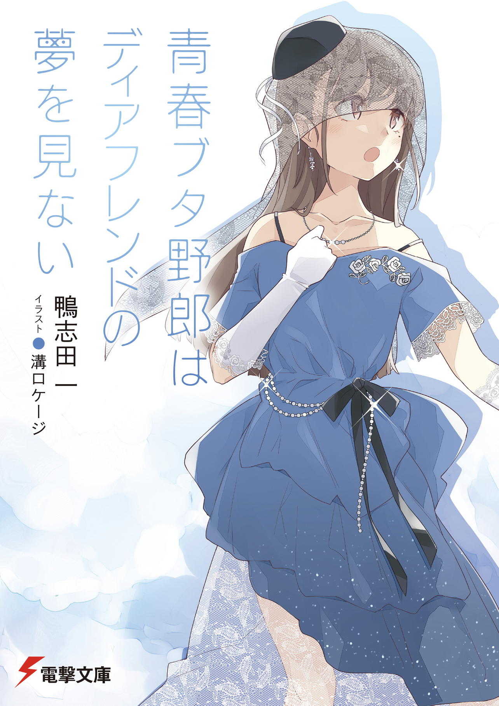

> 我真没想到，青猪读完后后劲太大了，导致这篇读后感竟然比我计划了大半年的东京漫游记要早写出来。
> 
> 什么你问我东京漫游记什么时候能发出来？
> 
> *~~咳咳，别问我，我也不知道，主要是因为我想写的太多了，然后拖延症就犯了...~~（汗）*

搁了一年，我终于有勇气把『青春猪头少年』系列最后两卷看完了。一直不看，是因为我不想让这部作品在我心里那么快结束。青猪对我来说是一部很特殊的作品，因为当初我入宅正是因为它。我依然记得第一次看青猪时心里的震撼：怎么能有如此精彩的故事。直到今天，我实在忍不住，点开了收藏许久的资源……

———**心里历程**———

这次我不想讨论剧情，只想就人物谈谈我这七年看法的改变。  

最初接触这部作品时，樱岛麻衣这个角色的塑造，满足了我对另一半的所有幻想。那段时间我是反复重温原著，每看一遍都在想，她怎么能这么善解人意……但随着时间推移，我的想法逐渐变成：翔子才是唯一神。在无数次的回味中，我慢慢发觉，如果樱岛麻衣是善解人意的代名词，那么牧之原翔子就是极致温柔的化身。她那风趣，又带点小恶魔属性，能在任何时刻，毫无保留地站在咲太身边。就算世界与咲太为敌，她也愿意陪着他，将他拉出深渊，即便代价是放弃自己的一切。她的温柔导致我自那之后很长一段时间里，我心中无可替代的第一位，始终是牧之原翔子，直到我把最后一卷看完，我变了…

老鸭啊……你怎么能这样。为什么只用了一卷，仅仅一卷，我就喜欢上了美东美织这个角色？你到底是怎么做到，只用一卷就把她塑造得如此成功？如果说樱岛麻衣和牧之原翔子是幻想中的完美女友，那么美东美织就像是现实中的朋友。她的痛苦你能切实感受到，她的烦恼与经历总让人忍不住去关注她。她在认清现实后，依然有勇气走上那条布满荆棘的路。她的痛苦、她那满不在乎的伪装、她最后的释然……明明角色本身没有什么突出亮点，却让人无法不注意她。美东美织就是这样一个角色，只要看过她的故事，就会深深记住她。

———**结尾**———

再来谈谈结局。我觉得老鸭这次太温柔了。至此，我已看完他的三部作品：『樱花庄的宠物女孩』、『Just Because！』和『青春猪头少年系列』。

如果说，老鸭用『樱花庄』讲述了青春的成长，用『Just Because！』表达了是青春的遗憾，那么『青春猪头少年』绝对就是他描绘青春落幕的集大成之作。在这部作品里，老鸭为每位角色都安排了一个最温柔的结局，虽然那未必是每个人最完美的结局，却一定是最贴合他们的结局。恰到好处并非每人都是最完美的结局，但确是最温柔的结局。而整个故事的落幕，恰如老鸭在最后一卷借咲太之口对青春期综合症的描述那样：

「 就像小时候把天花板上的花纹当成鬼怪的影子，长大以后，自然不会再把它看成鬼怪了。但天花板的纹样依然在那里，它成了一段美好的回忆。每当再看到它，就会想起自己曾经把它当作鬼怪的时光。 」

是啊，这大概就是老鸭所描绘的青春。在青春期时敢于尝试一切的少年，随着渐渐成熟，不再能做出那些散发着青春气息的举动，慢慢走入现实，但每当回想起从前疯狂的时光，总会会心一笑。正如陪伴了我七年的『青春猪头』故事完结般，那段独属于我的美好，也悄悄收进了回忆里。

<em>(这是青猪完结卷 第15卷 封面，上面的人物是美东美织，怎么样是不是很心动！！！)</em>
