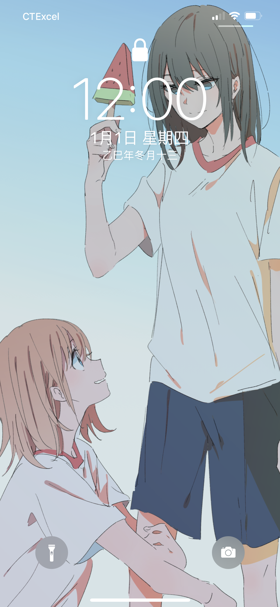

## 1
一眨眼，一年又过去了，和 2024 年相比，我觉得自己在 2025 年的前半年，过得反而比之前过得更加浑噩，像一台设定好的机器，醒来就开始忙，忙到睡下，一天就结束了。

我好像一直处在一种「什么都不想管，但又不得不管」的状态里，心情低迷，却又说不清到底在低迷些什么。几乎每天晚上，我都会对第二天抱有一点不切实际的期待：要不要为自己疯狂一把，去做一些平时不敢、也没时间做的事情。但每当第二天醒来，看着那一堆尚未完成的任务，这点幻想就会被现实毫不留情地浇灭。

有些朋友可能知道，今年五月我去了一趟东京。那段时间真的很快乐，每天都像打了鸡血一样，兴奋、充实，似乎对生活又充满了热情。但美好的时光总是短暂的，旅行一结束，那种机械式的生活又卷土重来，仿佛没有尽头。

## 2
转折出现在十月中旬。

月初我参加了 IBM 的面试，结束后自觉希望渺茫，没想到两周后，我竟收到了他们的offer。反复确认邮件不是幻觉后，我整个人一下子松了下来，人生似乎也不是处处都是坏事。

有些话，我只敢在这种年度总结里写出来，因为大概率也没人会认真看这篇文章，所以我才想在这里悄悄的把我这分惊喜记录下来。

我经常和来问我面试经验的人说，不要拿我当参考，因为我是一个 outlier，但我从来没有告诉过别人，这个 outlier 到底偏离到了什么程度。

我 IBM 的面试其实是我这个申请季的第一个正经面试。在此之前，我只面过一家很小的公司，整个过程不到 15 分钟，基本也只是问了问个人信息就结束了。所以当我真的拿到 IBM 的 offer 时，那种震惊和不真实感，是外人很难体会的。

也正是这次幸运，让我放下了长期以来背负的压力，或许我的未来依然是有希望的。从那一刻，我开始相信，「触底反弹」并不是毫无道理，人生从来都不是一帆风顺的，跌宕起伏才是常态，当你身处低谷时，把心态摆正，熬过去，总会看到希望的。

## 3
今年除了拿到了 IBM 的 offer 外，还有一件值得庆祝的事儿。

大概在今年 8 月份底的时候，我做了一个 Chrome 插件。起因其实很简单，我在B站看视频时，跳过视频中的植入广告这个步骤，对我有点过于繁琐了，所以我就在想，能不能做一个插件，帮我把这个过程简化掉。

一开始，我考虑过用LLM，通过识别视频中的音频去判断段是否为广告。我知道这个方案在技术上是可行的，但相比之下，我更想做一款足够轻量的插件，不依赖复杂的模型，不需要太多算法，只要在大多数情况下能减少我跳过广告的操作成本，就已经足够了。

这里要特别感谢我的两位好朋友 zzz 和 hyl，当我把这个想法讲给他们听时，他们给了我一个非常关键的思路，利用弹幕来进行判断。

当天晚上，我就根据这个思路，就把插件的主体框架写了出来。之后又花了大概一个月的时间不断优化和调整。最终，从我个人的使用体验来看，效果还是相当不错的，大约 80% 的视频，都可以准确识别并自动跳过广告。

在我把正式版发布后，这个项目在 GitHub 上目前已经收获了 75 个 star，而 Chrome 商店里也有超过 1000 名用户在使用这个插件。说实话，我自己都没想到，这个垃圾小插件，会有这么多人来用。

## 结语
以上，大概就是我 2025 年的全部了，总感觉写的好沉重（悲）

希望在 2026 年里，我能少一点负能量，多开心点，乐观点，轻松点。

~~哦对，还有一个flag：一定要把东京游记写出来，再拖下去，细节真要忘光了啊！！~~

最后，还是想祝愿大家都尽量乐观一点吧，既然悲观改变不了什么，不如让自己好过一些，用轻松的心态看待生活，肩上的压力会减轻很多！

2026 年 1 月 1 日，祝大家元旦快乐！

