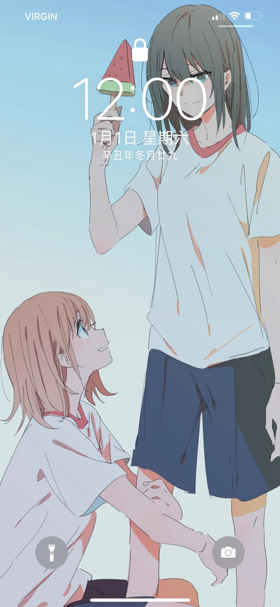

### 2021年总结
元旦啦！总结一下2021年吧，今年虽然受到疫情的影响，很多想做的事情都受到了限制，但是我还是在这一年里体验到了各式各样新鲜的事情，也感悟到了许多不同的道理，自己相较于去年也更加成熟了。

虽然在去年自己处理过的诸多事情都未能做到理想的样子，但在静下心来想想后发现，那些处理的不算完美的事件也算是一段令自己难忘的经历了，不是吗？

2021年虽是一个平凡且无趣的一年，但我觉得自己也称得上是过的充实了。

### 2022年展望
回归正题，今天是2022年1月1日，祝愿自己在今年也能够过得称心如意，并且能够完成去年未能实现的自己的目标。

### 结语

最后的最后祝各位在这崭新的一年里财到、运到、情到，过得舒坦、过得开心！

