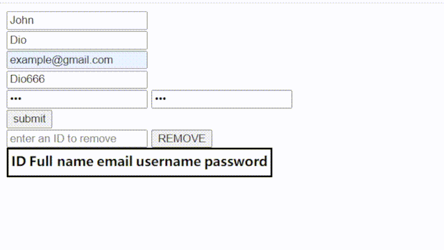
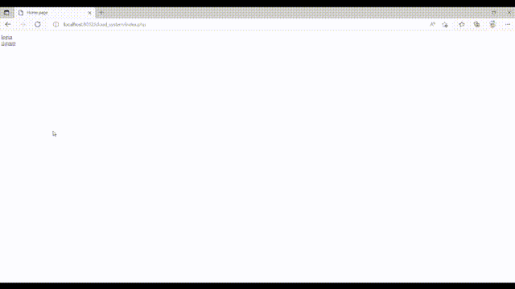
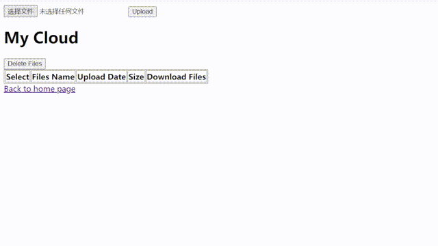
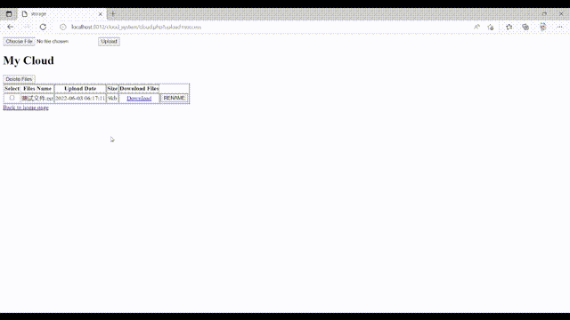
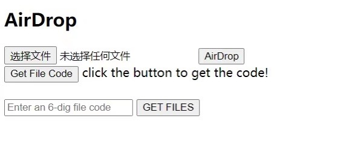
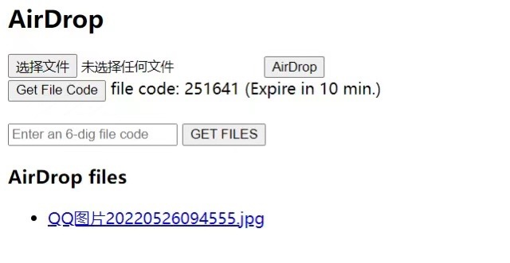

**第1天：启程**
- **学习目标：** 从零基础学习HTML和CSS，并在下周之内制作一个符合能力范围的网页。
- **进展：** 完成了HTML和CSS基础知识的学习。

---

**第2天：基础掌握**
- **进度：** 完成HTML基础学习，并开始学习CSS。
- **目标：** 在周日之前制作一个个人简介页面。

---

**第3天：CSS学习**
- **进度：** 完成了CSS基础知识的学习，开始接触JavaScript的应用。
- **目标：** 明天制作一个基础网页。

---

**第4天：继续学习**
- **进度：** 继续学习JavaScript的基础知识，开始思考如何将其应用到网页制作中。
- **目标：** 继续巩固JavaScript知识，为后续功能开发做准备。

---

**第5天：后端初探**
- **进度：** 学习了PHP和MySQL的基础知识，成功完成了一个小项目，连接数据库并实现信息上传。
- **目标：** 开始搭建主项目，解决脚本问题，并实现注册和登录功能。
- **本周任务：**
  - 实现注册和登录功能
  - 解决脚本替代方法
- **进度展示：**

---

**第6天：状态调整**
- **进度：** 休息日，整理学习思路，准备后续工作。

---

**第7天：学习进展**
- **进度：** 继续学习PHP和MySQL，准备开始主项目的搭建。
- **目标：** 完成注册和登录功能的开发。

---

**第8天：后端开发**
- **进度：** 实现了用户注册和登录功能，开始测试功能的稳定性。
- **目标：** 解决注册和登录过程中的问题，优化功能。

---

**第9天：系统优化**
- **进度：** 对用户注册和登录功能进行优化，修复了发现的问题。
- **目标：** 继续完善功能，准备添加新的功能模块。

---

**第10天：状态调整**
- **进度：** 身体不适，休息一天，调整状态为接下来的开发做准备。

---

**第11天：云存储功能**
- **进度：** 实现了用户云存储功能，用户可以自由下载存储的文件。
- **目标：** 继续开发其他功能，并优化用户体验。
- **本周任务：**
  - 实现文件删除功能
  - 完成重命名文件功能
  - 美化UI
- **进度展示：**

---

**第12天：功能开发**
- **进度：** 继续开发文件管理功能。
- **目标：** 实现文件删除功能。

---

**第13天：功能开发**
- **进度：** 处理删除文件功能，准备开发重命名文件功能。
- **目标：** 完成重命名文件功能的开发。

---

**第14天：功能完善**
- **更新：** 完成文件删除功能和重命名文件功能。
- **日志：** 重命名功能在测试中发现了bug，修复工作正在进行。
- **本周任务：**
  - 完成文件删除功能
  - 解决重命名文件功能的bug
  - 美化UI
- **进度展示：**

---

**第15天：临时传输功能**
- **进度：** 解决了重命名功能的bug，开始开发临时文件传输功能。
- **目标：** 实现临时文件传输功能，用户可通过验证码共享文件。
- **本周任务：**
  - 实现临时文件传输功能
  - 美化UI
- **进度展示：**

---

**第16天：状态调整**
- **进度：** 休息一天，调整开发进度。

---

**第17天：继续开发**
- **进度：** 继续开发临时文件传输功能，并开始美化UI。
- **目标：** 完成临时文件传输功能的开发。

---

**第18天：功能完成**
- **更新：** 完成了临时文件传输功能，并对UI进行了初步美化。
- **日志：** 本周任务基本完成，临时传输功能仍有些小问题，但不影响使用。
- **进度展示：**
  - 临时传输界面
    
  - 获取临时文件
    
---

**第19天：总结与展望**
- **进度：** 20天的学习和开发过程已完成，主要功能已开发完毕。感谢项目的推动，让我学习了许多新技术。
- **目标：** 不定期更新项目，修复小问题，添加新功能。
- **GitHub项目链接：** [Cloud-System](https://github.com/wzy403/Cloud-System)

---

**第20天：总结**
- **日志：** 今天对所有代码进行了注释，为日后的维护和更新做准备。项目的基础功能已完成，将**不定期更新**。

---

### 总结

这20天的学习和开发让我从零基础开始，掌握了HTML、CSS、JavaScript、PHP、MySQL等技术，并成功实现了一个功能完备的网站。虽然还有一些小问题需要修复，但我已经为自己的进展感到自豪。感谢大家的关注，希望未来能继续提升和完善项目！

