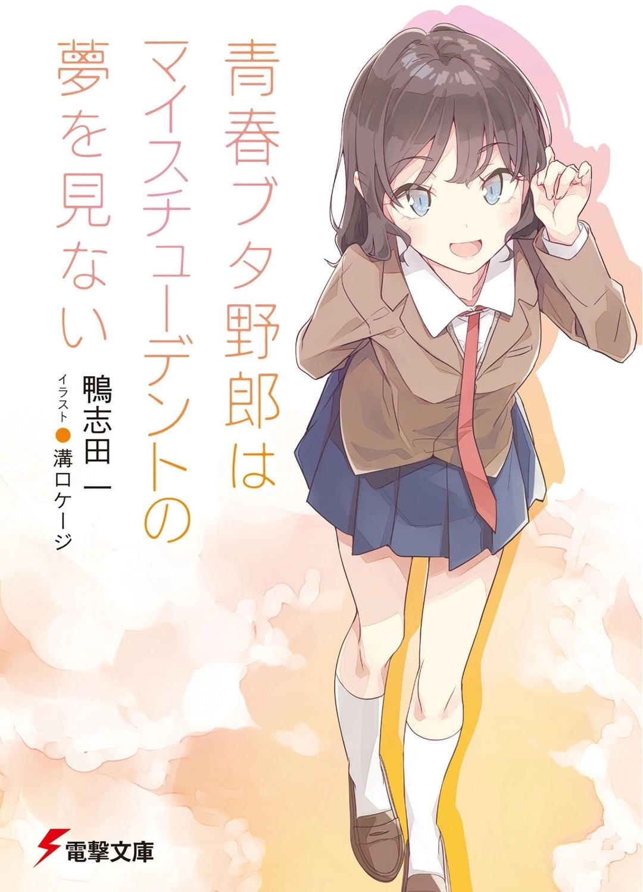

**感觉我好久没写长评了……**

跟我认识久的人都知道我是《青猪》的粉丝，属于那种成天给别人安利这本书的人。这不，前几天《青猪》第十二卷发售了，我也抽空读完了。于是，来简单说说第十二卷《青春野狼不做自家学生的梦》的读后感，以及我对目前已存在伏笔的推理吧：

（以下文章含有剧透，请谨慎观看）

———**读后心情**———

这一卷主要讲述了姬路纱良陷入青春期综合症的故事。这一卷也呈现了继古贺朋绘之后的第二个师傅的败犬名场面……真的笑死我了。你麻衣学姐还是你麻衣学姐，把自以为段位很高的小妹妹玩弄于鼓掌之间的剧情，真的太适合乐子人了。

———**伏笔&推测**———

乐归乐，但通过第十二卷的内容，我们了解到一个线索：雾岛透子曾经讨厌麻衣。虽然本篇的主线不是雾岛透子，但她的设定引出了很多细节，比如：她曾是模特、她可以给予人们未来片段的梦境、她的歌声可以促使别人患上青春期综合症。尽管上一卷中平行时空的咲太曾说过麻衣有危险，但通过这一卷现时空的咲太对透子的了解，透子不会直接伤害麻衣……剩下的选项也只有咲太推测的，通过某些手段，透子在不经意间使麻衣处于危险当中。而故事最后，鸭志老贼的深坑也间接证明了这一点。与咲太，或者说与麻衣有关系的人都做了预知梦，除了麻衣自己……

因此，结合这些伏笔，我大胆推测……雾岛透子从事模特行业多年，但优秀的麻衣可能在不经意间破坏了透子的事业，导致透子十分讨厌麻衣，从而产生了青春期综合症。而透子所换上的青春期综合症的症状极有可能是操控未来的功能，但这个功能的副作用是，她在操控未来后，与被改变的未来有关系的人，将会做关于新未来的预知梦。不过，这个未来不是定数，做了预知梦的人可以根据梦境的结果选择新的道路，从而再次改变未来。在上一卷中，赤城郁实便是运用`#做梦`的标签多次改变未来的结果，本章咲太也是如此。在得知预知梦的内容后，他多次间接或直接改变了原本的未来走向。因此，本卷终章的伏笔显示，所有人都做了预知梦，除了麻衣。这是否意味着雾岛透子在操控未来时不经意间删除了关于麻衣的未来，而这也导致所有与麻衣有关的人都做了这个预知梦，而麻衣因为没有了那段未来所以才没有做预知梦。这也合理解释了平行时空的咲太传来的消息：`“快去找雾岛透子，麻衣同学有危险”`。正因为雾岛透子是在不经意间删除了麻衣的未来，才需要让现时空的咲太注意到透子这件事。至于为什么平行时空的咲太会知道这件事，我推测很可能是因为在平行时空的麻衣已经出现了危险，或者已经被删除了。而那边的咲太可能找到了让一切恢复如初的方法，就是让现时空的咲太间接或直接解决现时空透子的青春期综合症……那么，我们是不是可以得出一个结论：透子影响的未来不仅限于现时空，还包括所有平行宇宙的时间线，而平行时空的咲太正是因为发现了这件事，才给现时空的咲太发出了麻衣有危险的警告……嘶，这么想下去，真的有点不寒而栗的感觉。

———**结尾**———

推测归推测，现实情况还是要看鸭志老贼怎么写了……但我还是要吐槽一下鸭志老贼出书的速度。一个伏笔埋了三年，一年出一本，你知道我这三年是怎么过来的吗？我从三年前的红衣小女孩开始等，直到现在都还没收回去……急死我了。咳咳，回归正题，我对第十二卷的评价依然是满分10/10。不管是伏笔的设立，还是对情节的把控，鸭志田一老师可以说都做到了极致。整本书没有一处让读者感到无聊，每一句台词都是在为之后的剧情做铺垫。虽然老贼出书速度慢，但有这样的剧情把控力，等这么久也值了。我真心推荐对恋爱、科幻类小说感兴趣的朋友可以试试《青猪》系列，因为这个系列一定会给你一个良好的阅读体验。

